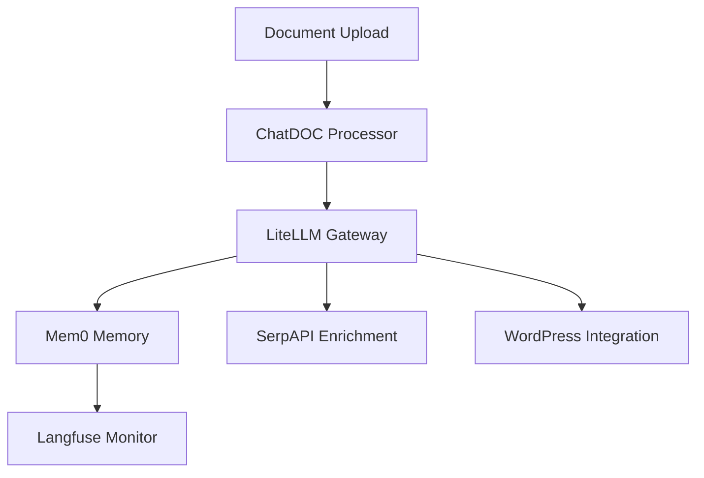

# System Patterns

## Architecture Overview

### Frontend Architecture
The frontend follows a component-based architecture using Next.js 14 with React Server Components. Key patterns include:

1. **Component Organization**
   - `/components`: Reusable UI components
   - `/app`: Page components and routing
   - `/hooks`: Custom React hooks
   - `/lib`: Utility functions and configurations

2. **State Management**
   - React Query for server state
   - Local state with useState for UI state
   - Custom hooks for complex state logic

3. **Data Fetching**
   - React Query for caching and synchronization
   - Custom hooks for API interactions
   - Proper error handling and loading states

### Backend Architecture
The backend uses Next.js API routes with Prisma as the ORM. Key patterns include:

1. **API Routes**
   - RESTful endpoints in `/api` directory
   - Proper error handling and validation
   - Authentication middleware
   - Consistent response formats

2. **Database Access**
   - Prisma Client for database operations
   - Proper transaction handling
   - Efficient query optimization

## Design Patterns

### Component Patterns
1. **Compound Components**
   - DataTable with sorting and pagination
   - Modal dialogs with shared context

2. **Custom Hooks**
   - useDebounce for input optimization
   - useDocuments for data fetching
   - useUsers for user management

3. **Higher-Order Components**
   - Authentication guards
   - Loading state wrappers

### Data Flow Patterns
1. **Unidirectional Data Flow**
   - Props down, events up
   - Centralized state management
   - Clear data update patterns

2. **Server State Management**
   - React Query for caching
   - Optimistic updates
   - Background refetching

### Error Handling Patterns
1. **API Error Handling**
   - Consistent error responses
   - Type-safe error handling
   - User-friendly error messages

2. **UI Error Handling**
   - Toast notifications
   - Error boundaries
   - Fallback UI components

## Technical Decisions

### Frontend
1. **UI Framework**: shadcn/ui
   - Consistent design system
   - Accessible components
   - Easy customization

2. **State Management**: React Query
   - Efficient caching
   - Real-time synchronization
   - Optimistic updates

3. **Type Safety**
   - TypeScript throughout
   - Zod for validation
   - Prisma-generated types

### Backend
1. **Database**: PostgreSQL with Prisma
   - Type-safe queries
   - Easy migrations
   - Efficient relations

2. **Authentication**: NextAuth.js
   - Secure sessions
   - Multiple providers
   - Easy integration

3. **API Design**
   - RESTful principles
   - Proper status codes
   - Consistent response format

## Component Relationships

### Updated Architecture


New modules added:
- `modules/document-traceability`
- `modules/llm-gateway` 
- `modules/external-data`

## Module Communication

* **Document Extraction Flow:**
  1. Document uploaded via UI
  2. Content sent to LiteLLM API
  3. Response parsed and validated
  4. Data stored in PostgreSQL via Prisma
  5. Results displayed in UI

* **Type System Integration:**
  - Prisma schema defines database types
  - Service layer implements business logic types
  - UI components consume processed data
  - Type safety maintained across all layers

## Best Practices
1. **Code Organization**
   - Feature-based structure
   - Clear separation of concerns
   - Consistent naming conventions

2. **Performance**
   - Debounced inputs
   - Optimized queries
   - Proper caching

3. **Security**
   - Input validation
   - Authentication checks
   - Permission validation

4. **Testing**
   - Unit tests for utilities
   - Integration tests for API
   - Component testing

## Component Architecture

### Core Principles
1. Modular Design
   - Each component is self-contained
   - Clear interface definitions
   - Minimal external dependencies
   - Reusable across pages

2. Type Safety
   - TypeScript interfaces for all props
   - Strict type checking
   - Proper error types
   - Generic types where appropriate

3. State Management
   - Local state with useState
   - Props for component configuration
   - Event handlers for user interactions
   - Prepared for API integration

### Component Categories

1. Document Components
   ```typescript
   DocumentViewer {
     props: {
       documentUrl: string
       documentContent: string
       documentType: string
       fileName: string
       metadata: Record<string, any>
     }
   }

   DocumentMetadata {
     props: {
       documentId: string;
       initialTitle: string;
       initialTags: Tag[]; // Updated props
       initialMetadata?: MetadataField[]; // Custom metadata separate
     }
   }

   DocumentHistory {
     props: {
       documentId: string
       versions: DocumentVersion[]
       onRestore: (versionId: string) => void
       onDownload: (versionId: string) => void
     }
   }
   ```

2. List Components
   ```typescript
   EntityList {
     props: {
       documentId: string
       entities: Entity[]
       onEntityAdd: (entity: Omit<Entity, 'id'>) => void
       onEntityRemove: (entityId: string) => void
     }
   }

   RecentDocuments {
     props: {
       documents: RecentDocument[]
       onDocumentClick: (documentId: string) => void
       onViewAll: () => void
     }
   }
   ```

3. Management Components
   ```typescript
   CloudSourceConnector {
     props: {
       sources: CloudSource[]
       onSourceAdd: (source: Omit<CloudSource, 'id' | 'status'>) => void
       onSourceEdit: (sourceId: string, source: Partial<CloudSource>) => void
       onSourceDelete: (sourceId: string) => void
       onSourceSync: (sourceId: string) => void
     }
   }

   RoleList {
     props: {
       roles: Role[]
       availablePermissions: Permission[]
       onRoleAdd: (role: Omit<Role, 'id'>) => void
       onRoleEdit: (roleId: string, role: Partial<Role>) => void
       onRoleDelete: (roleId: string) => void
     }
   }
   ```

## Page Architecture

### Layout Pattern
```typescript
PageLayout {
  header: {
    title: string
    actions: ReactNode
  }
  sidebar?: ReactNode
  main: ReactNode
  footer?: ReactNode
}
```

### Page Types
1. Document Pages
   - Dynamic routing with [id]
   - Tab-based navigation
   - Sidebar for metadata
   - Main content area

2. List Pages
   - Grid or list layout
   - Filtering options
   - Sorting capabilities
   - Pagination support

3. Management Pages
   - Form-based interfaces
   - Validation handling
   - Success/error feedback
   - Confirmation dialogs

## Data Flow Patterns

### Component Data Flow
1. Props Down
   - Configuration via props
   - Type-safe prop definitions
   - Default values where appropriate
   - Required vs optional props

2. Events Up
   - Event handler props
   - Callback functions
   - Error propagation
   - Loading states

### State Management
1. Local State
   - Component-specific state
   - Form state
   - UI state (dialogs, tabs)
   - Loading/error states

2. Future Patterns (Planned)
   - React Query for API data
   - Context for global state
   - Redux for complex state
   - Persistent storage
   - Context API (e.g., FolderContext) for sibling communication

## UI Patterns

### Design System
1. Components
   - shadcn/ui base
   - Consistent styling
   - Responsive design
   - Accessibility support

2. Layout
   - Grid system
   - Responsive breakpoints
   - Spacing scale
   - Container widths

3. Typography
   - Font scale
   - Line heights
   - Font weights
   - Text colors

4. Interactive Elements
   - Hover states
   - Focus states
   - Loading states
   - Error states

## Error Handling

### Component Level
1. Type Validation
   - Props validation
   - Data type checking
   - Required field validation
   - Format validation

2. User Input
   - Form validation
   - Error messages
   - Field-level errors
   - Form-level errors

3. API Integration (Planned)
   - Request errors
   - Response validation
   - Error boundaries
   - Fallback UI

## Testing Strategy (Planned)

### Test Types
1. Unit Tests
   - Component rendering
   - Props validation
   - Event handling
   - State management

2. Integration Tests
   - Component interaction
   - Page navigation
   - Data flow
   - Error scenarios

3. E2E Tests
   - User flows
   - Critical paths
   - Edge cases
   - Performance

## Folder Management System

### Data Structure
- `FolderWithCounts` interface represents the hierarchical folder structure:
  ```typescript
  interface FolderWithCounts extends Folder {
    _count: {
      documents: number;
      children: number;
    };
    documentCount: number; // UI convenience field
    children: FolderWithCounts[]; // Nested folders
  }
  ```

### State Management
- Uses TanStack Query (React Query) for server state management
- Folder tree state is managed through the `useFolders` hook
- Local UI state for folder operations (create, edit, delete, move) managed with React's useState
- Expanded/collapsed state managed with a Set of folder IDs

### Drag and Drop System
- Uses `@dnd-kit` library for drag and drop functionality
- Implements a hierarchical drag and drop system:
  - Folders can be dragged and dropped into other folders
  - Prevents circular references (folder can't be moved into its own subtree)
  - Shows visual feedback during drag operations
  - Confirms folder moves through a dialog

### Component Architecture
1. **DraggableFolderTree**
   - Main container component
   - Manages folder tree state and operations
   - Handles drag and drop events
   - Provides context for folder operations

2. **DraggableFolderNode**
   - Individual folder component
   - Handles folder-level operations (rename, delete)
   - Manages expand/collapse state
   - Shows document count and nested folders

3. **CreateFolderDialog**
   - Modal dialog for folder creation
   - Handles folder name input and validation

### API Integration
- RESTful endpoints for folder operations:
  - GET `/api/folders` - Fetch folder tree
  - POST `/api/folders` - Create new folder
  - PATCH `/api/folders/:id` - Update folder
  - DELETE `/api/folders/:id` - Delete folder
  - PATCH `/api/folders/:id/move` - Move folder

### Error Handling
- Toast notifications for operation feedback
- Validation checks:
  - Prevent deletion of non-empty folders
  - Validate folder names
  - Check for circular references in moves
  - Handle API errors with user-friendly messages

### UI/UX Patterns
- Hierarchical visualization with indentation
- Visual feedback for drag and drop operations
- Confirmation dialogs for destructive actions
- Loading states for async operations
- Expandable/collapsible folder tree
- Document count indicators
- Context menus for folder operations
